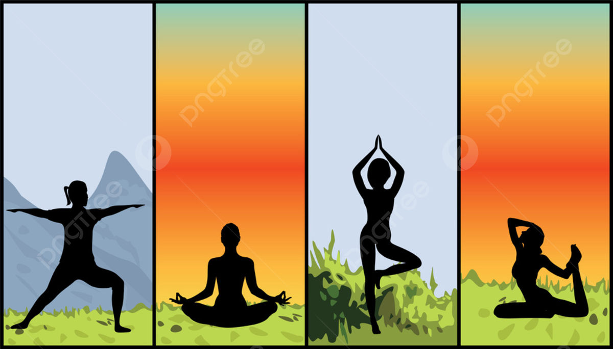

# Equilibri Ai

<h1>Description</h1>
Hi welcome to this deep learning project "Equilibri AI ". This project as the name suggests can predict the yoga poses; which can even be trained by you or your teacher. 
This project comprise of three python scripts namely, 
Data Collection 
Data Training 
And finally Inference script. 
As all of the name suggest do there respective work. 

For this project mediapipe pose detection is implemented to detect the human body pose and after that is created into a model with simple Dense network using keras and trained the model on the data. After that the inference file is executed to for prediction. 

<h1>Requirements</h1>
<code>pip install mediapipe</code> 
<code>pip install keras</code> 
<code>pip install tensorflow</code> 
<code>pip install opencv-python</code> 
<code>pip install numpy</code> 
<code>pip install kivy</code> 
<code>pip install kivymd</code> 

<h1>How to Run?</h1>
<h2>Adding Data</h2>
  To add data you have to run <b>python data_collection.py</b> and  have to provide the name of asana you want to add.
 <h2>Training</h2>
  To train just run <b>python data_training.py</b> to train the model on newly added data.
  <h2>Running</h2>
  To Run just run <b>python inference.py</b> and new window will pop up which will be running the predictions.

  
